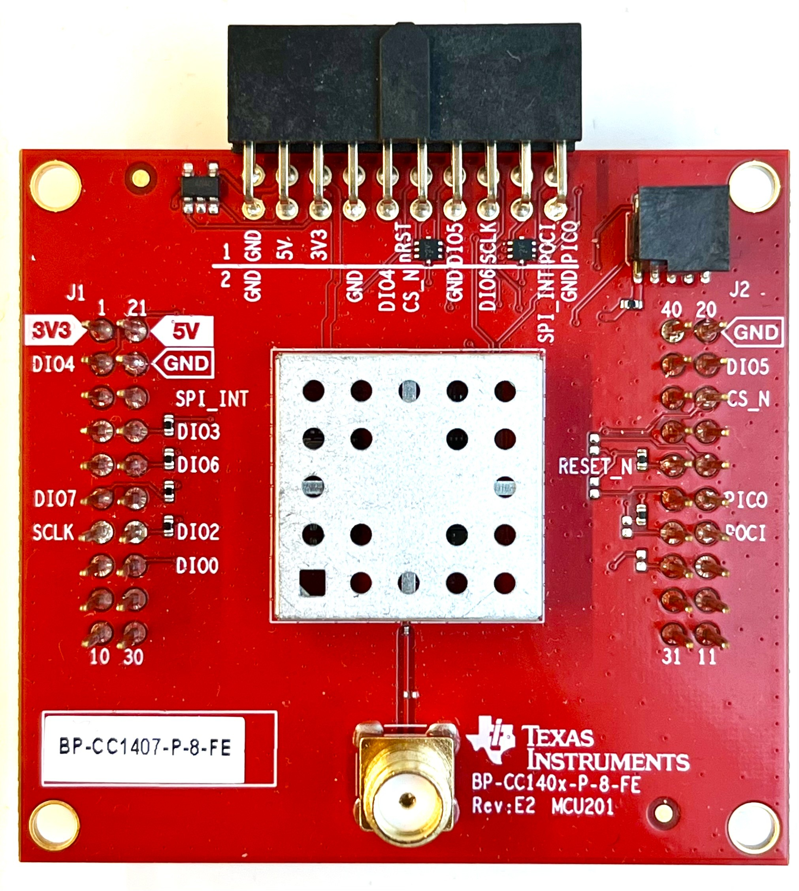
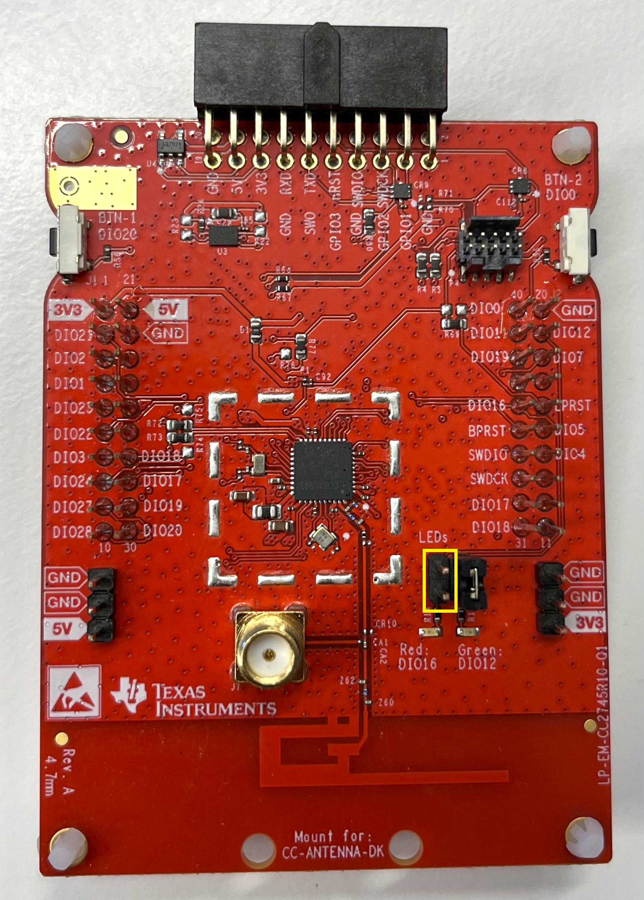
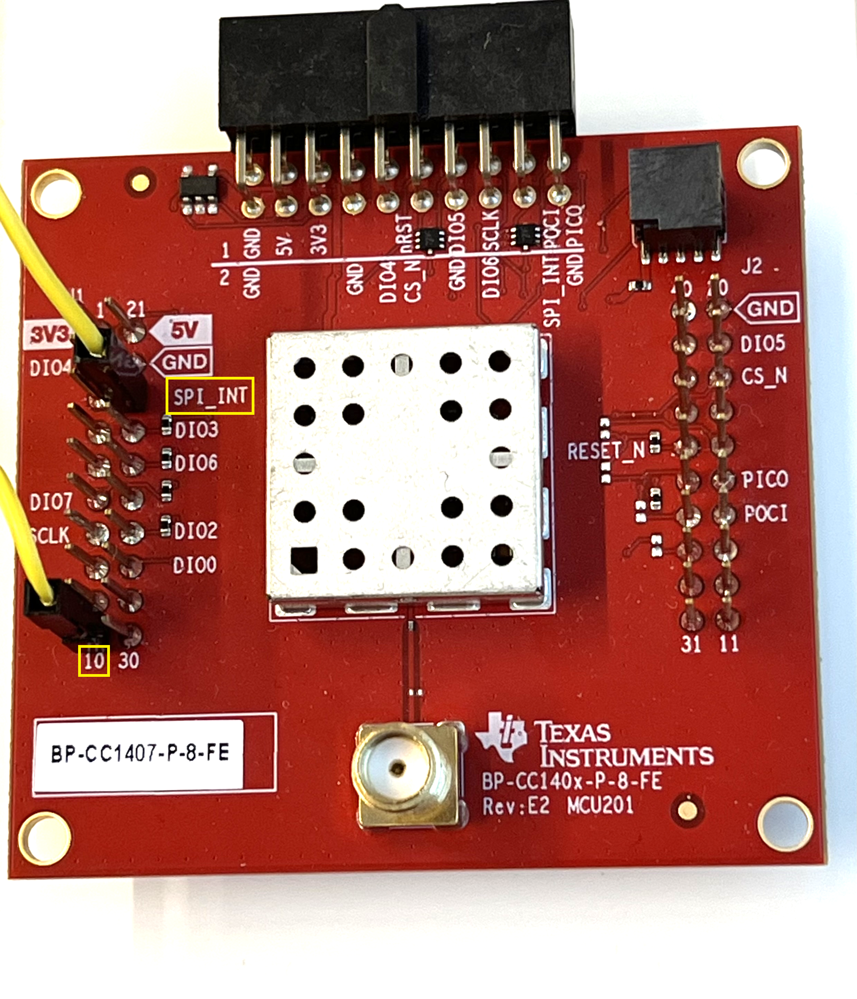

.. _ti_bp_cc140xp:

TI BP-CC140xP: CC140xP Transceiver BoosterPack
###############################################

Overview
********

The BP-CC140xP BoosterPack adds a TI CC140xP Sub-1 GHz transceiver to a TI
LaunchPad |trade| development kit via the standard 40-pin BoosterPack
connector.

This covers all four variants of the BP-CC140xP:

  - BP-CC1402P-8-FE
  - BP-CC1407P-8-FE
  - BP-CC1402P-9-FE
  - BP-CC1407P-9-FE

   BP-CC1407P-8-FE BoosterPack module

Requirements
************

This shield can be used with any TI LaunchPad |trade| development kit that
exposes the ``boosterpack_spi`` and ``boosterpack_header`` devicetree
connector nexus.

Connecting to a Non-TI LaunchPad |trade| Host
*********************************************

This shield's overlay is written against the ``boosterpack_spi`` and
``boosterpack_header`` devicetree nexus, which only exists on TI LaunchPad
|trade| boards. To use the BP-CC140xP with a non-TI LaunchPad |trade| host - or any host that
does not expose that nexus - skip this shield entirely: wire the module's
SPI bus and GPIO signals directly to the host, then write a plain
application overlay that references the host's SPI and GPIO controllers
directly instead of going through a BoosterPack connector. See
``samples/shields/ti_bp_cc140xp/new_board.overlay.example`` for the devicetree
pattern to copy.

The following signals shall be connected:

======================  ====================================================
Shield Connector Pin                  Function / Name on Shield
======================  ====================================================
7                       SCLK
14                      POCI
15                      PICO
18                      CS_N
23                      SPI_INT
36                      RESET_N
======================  ====================================================

Wire each signal above to a free SPI or GPIO pin on the host, then declare
the device node directly against the host's own SPI controller:

.. code-block:: devicetree

   &your_spi_bus {
      status = "okay";
      cs-gpios = <&your_gpio_controller PIN GPIO_ACTIVE_LOW>;

      ti_cc140xp: ti_cc140xp@0 {
         compatible = "ti,cc140xp-trx";
         reg = <0>;
         spi-max-frequency = <12000000>;
         reset-gpios = <&your_gpio_controller PIN GPIO_ACTIVE_LOW>;
         trx-host-spi-int-gpios = <&your_gpio_controller PIN GPIO_ACTIVE_LOW>;
         poci-gpios = <&your_gpio_controller PIN GPIO_ACTIVE_LOW>;
      };
   };

Hardware Setup
**************

.. note::

   The following adjustments are required specifically when pairing this
   shield with the LP-CC2745R10-Q1 LaunchPad, which was the development and
   test setup for this shield. Other host boards may not need them.

DIO16 Jumper Removal
======================

On the LP-CC2745R10-Q1, the jumper for the red LED (DIO16) shall be removed.
DIO16 is routed to both the red LED on the LP-CC2745R10-Q1 and ``RST`` on
the BP-CC140xP, so leaving the jumper in place may introduce unintentional
behavior. With the jumper removed, the red LED is unavailable and only the
green LED (DIO12) remains free to use.

   DIO16 (red LED) jumper removed on the LP-CC2745R10-Q1

.. note::

   Using this shield on the LP-CC2745R10-Q1 currently still requires an
   application-level board overlay for pre-existing, board-specific fixups
   unrelated to this shield: SPI0/on-board-flash CS sharing, an SPI1
   pinctrl/PM conflict on DIO12/DIO16, and disabling the ``led1`` node (which
   shares DIO16 with this shield's ``RST`` line). See the existing
   ``ti_cc140xp_*`` sample overlays for the current reference implementation
   of these fixups.

SPI_INT Hotwire
================

When using the BP-CC140xP in combination with the LP-CC2745R10-Q1, a jumper cable is needed.
On the BP-CC140xP, the ``SPI_INT`` (PIN 23) shall be connected to the header pin in the bottom
left (PIN 10). The corresponding pin of the LP-CC2745R10-Q1 "below" ``SPI_INT`` on the
BP-CC140xP is not available, so a hotwire bridge to this alternate pin is
needed as a workaround. See `Quick Start Guide LP-CC2745`_ for full DIO map.

   ``SPI_INT`` hotwire bridge between the BP-CC140xP and LP-CC2745R10-Q1

Programming
***********

Set ``--shield ti_bp_cc140xp`` when you invoke ``west build``. For example:

.. zephyr-app-commands::
   :zephyr-app: samples/shields/ti_bp_cc140xp/ti_cc140xp_tx
   :board: lp_em_cc2745r10_q1/cc2745r10_q1
   :shield: ti_bp_cc140xp
   :goals: build

References
**********

.. target-notes::

.. _Quick Start Guide LP-CC2745: https://dev.ti.com/tirex/explore/node?isTheia=false&node=A__AOXstiprUQ3YtucH8b62gQ__lpf3_devtools__FUz-xrs__LATEST&placeholder=true