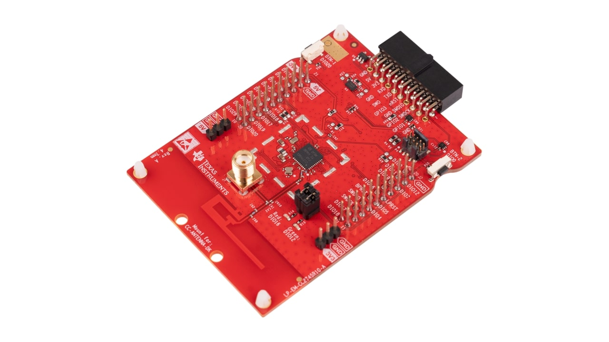

.. _lp_em_cc2755p10:

TI CC2755P10 Launchpad
#########################

Overview
********

The Texas Instruments CC2755P10 LaunchPad |trade| (LP_EM_CC2755P10) is a
development kit for the SimpleLink |trade| multi-Standard CC2755P10 wireless MCU.

See the `TI CC2755P10 LaunchPad Product Page`_ for details.

   Texas Instruments CC2755P10 LaunchPad |trade|

Hardware
********

The CC2755P10 LaunchPad |trade| development kit features the CC2755P10 wireless MCU.
The board is equipped with two LEDs, two push buttons and BoosterPack connectors
for expansion.

The CC2755P10 wireless MCU has a 96 MHz Arm |reg| Cortex |reg|-M33 SoC and an
integrated 2.4 GHz transceiver supporting multiple protocols including Bluetooth
|reg| Low Energy and IEEE |reg| 802.15.4.

The CC2755P10 wireless MCU supports additional protocols such as Matter, Thread, and Zigbee

See the `TI CC2755P10 Product Page`_ for additional details.

Supported Features
==================

The CC2755P10 LaunchPad board configuration supports the following hardware
features:

+-----------+------------+----------------------+
| Interface | Controller | Driver/Component     |
+===========+============+======================+
| GPIO      | on-chip    | gpio                 |
+-----------+------------+----------------------+
| UART      | on-chip    | uart                 |
+-----------+------------+----------------------+

Other hardware features have not been enabled yet for this board.

Connections and IOs
===================

All I/O signals are accessible from the BoosterPack connectors. Pin function
aligns with the LaunchPad standard.

+-------+-----------+-------------------------+
| Pin   | Function  | Usage                   |
+=======+===========+=========================+
| DIO0  | GPIO      |  Button 2               |
+-------+-----------+-------------------------+
| DIO1  | UART_TX   | UART TX                 |
+-------+-----------+-------------------------+
| DIO2  | UART_RX   | UART RX                 |
+-------+-----------+-------------------------+
| DIO3  | SPI_CLK   | SPI CLK                 |
+-------+-----------+-------------------------+
| DIO4  | SPI_POCI  | SPI POCI                |
+-------+-----------+-------------------------+
| DIO5  | SPI_PICO  | SPI PICO                |
+-------+-----------+-------------------------+
| DIO7  | SPI_CSN   | SPI CS                  |
+-------+-----------+-------------------------+
| DIO9  | SWD_IO    | SWD IO                  |
+-------+-----------+-------------------------+
| DIO10 | SWD_CK    | SWD CK                  |
+-------+-----------+-------------------------+
| DIO11 | GPIO      |                         |
+-------+-----------+-------------------------+
| DIO12 | GPIO      | Green LED               |
+-------+-----------+-------------------------+
| DIO16 | GPIO      | RED LED                 |
+-------+-----------+-------------------------+
| DIO17 | ANALOG_IO | CAN TX / A8             |
+-------+-----------+-------------------------+
| DIO18 | ANALOG_IO | CAN RX / A7             |
+-------+-----------+-------------------------+
| DIO19 | ANALOG_IO | I2S SDO / A6            |
+-------+-----------+-------------------------+
| DIO20 | ANALOG_IO | I2C SDI / A5 / Button 1 |
+-------+-----------+-------------------------+
| DIO21 | ANALOG_IO | A4                      |
+-------+-----------+-------------------------+
| DIO22 | ANALOG_IO |   A3                    |
+-------+-----------+-------------------------+
| DIO23 | GPIO      |                         |
+-------+-----------+-------------------------+
| DIO24 | GPIO      |                         |
+-------+-----------+-------------------------+
| DIO27 | I2C_SCL   | I2C SCL                 |
+-------+-----------+-------------------------+
| DIO28 | I2C_SDA   | I2C SDA                 |
+-------+-----------+-------------------------+

Programming and Debugging
*************************

The LP_EM_CC2755P10 requires an external debug probe such as the LP-XDS110 or
LP-XDS110ET.

Currently there is no debug support in Zephyr for the LP_EM_CC2755P10, and the
built binaries for this target must be flashed/debugged using either Uniflash or
Code Composer Studio.

References
**********

.. _TI CC2755P10 LaunchPad Quick Start Guide:
   https://www.ti.com/lit/ug/swru635/swru635.pdf
.. _TI CC2755P10 LaunchPad Product Page:
   https://www.ti.com/tool/LP-EM-CC2745R10-Q1

.. _TI CC2755P10 Product Page:
   https://www.ti.com/product/CC2745R10-Q1
